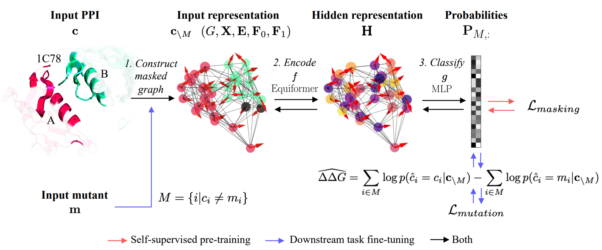

<div align="center">

# PPIformer

[](https://arxiv.org/abs/2310.18515)
[](https://doi.org/10.5281/zenodo.12789167)
[](https://opensource.org/licenses/MIT)
[](https://huggingface.co/spaces/anton-bushuiev/PPIformer)

</div>

<p align="center">
  
</p>

PPIformer is a state-of-the-art predictor of the effects of mutations on protein-protein interactions (PPIs), as quantified by the binding energy changes (ddG). The model was pre-trained on the [PPIRef](https://github.com/anton-bushuiev/PPIRef) dataset via a coarse-grained structural masked modeling and fine-tuned on [SKEMPI v2.0](https://life.bsc.es/pid/skempi2) via log odds. PPIformer was shown to successfully identify known favorable mutations of the [staphylokinase thrombolytic](https://pubmed.ncbi.nlm.nih.gov/10942387/) and a [human antibody](https://www.pnas.org/doi/10.1073/pnas.2122954119) against the SARS-CoV-2 spike protein. Please see more details in [our paper](https://arxiv.org/abs/2310.18515).

Please do not hesitate to contact us or create an issue/PR if you have any questions or suggestions. ✌️

## Web on Hugging Face Spaces 🤗

The preview of PPIformer is available via an interactive user interface on Hugging Face Spaces:

[](https://huggingface.co/spaces/anton-bushuiev/PPIformer)

## Installation

**Step 1.** To install PPIformer locally, clone this repository and install the environment (you may need to adjust the versions of the PyTorch-based packages in the script depending on your system):

```bash
conda create -n ppiformer python==3.10 -y
conda activate ppiformer
git clone https://github.com/anton-bushuiev/PPIformer; cd PPIformer
pip install -e .
```

**Step 2.** After installation, you may need to adapt PyTorch to your system. Please see the [official PyTorch
installation guide](https://pytorch.org/get-started/locally/) for details. For example, if you are using AMD GPUs, you may need to install PyTorch for ROCm:

```bash
pip install -U torch --index-url https://download.pytorch.org/whl/rocm6.0
```

## Inference

```python
import torch
from ppiformer.tasks.node import DDGPPIformer
from ppiformer.utils.api import download_from_zenodo, predict_ddg
from ppiformer.definitions import PPIFORMER_WEIGHTS_DIR, PPIFORMER_TEST_DATA_DIR

# Download the weights
download_from_zenodo('weights.zip')

# Load the ensamble of fine-tuned models
device = 'cpu'
models = [DDGPPIformer.load_from_checkpoint(PPIFORMER_WEIGHTS_DIR / f'ddg_regression/{i}.ckpt', map_location=torch.device(device)).eval() for i in range(3)]

# Specify input
ppi_path = PPIFORMER_TEST_DATA_DIR / '1bui_A_C.pdb'  # PDB or PPIRef file (see https://ppiref.readthedocs.io/en/latest/extracting_ppis.html)
muts = ['SC16A', 'FC47A', 'SC16A,FC47A']  # List of single- or multi-point mutations

# Predict
ddg = predict_ddg(models, ppi_path, muts)
ddg
> tensor([-0.3708,  1.5188,  1.1482])
```

## Training and testing

To train and validate PPIformer, please see `PPIformer/scripts/README.md`. To test the model and reproduce the results from the paper, please see `PPIformer/notebooks/test.ipynb`.

## How it works

<p align="center">
  
</p>

The model was pre-trained on the [PPIRef](https://github.com/anton-bushuiev/PPIRef) dataset via a coarse-grained structural masked modeling and fine-tuned on the [SKEMPI v2.0](https://life.bsc.es/pid/skempi2) dataset via log odds. 

A single pre-training step starts with randomly sampling a protein-protein interaction  (in this example figure, the staphylokinase dimer A-B from the PDB entry 1C78) from PPIRef. Next, randomly selected residues  are masked to obtain the masked interaction . After that, the interaction is converted into a graph representation  with masked nodes  (black circles). The model subsequently learns to classify the types of masked amino acids by acquiring -invariant hidden representation  of the whole interface via the encoder  and classifier  (red arrows). On the downstream task of ddG prediction, mutated amino acids are masked, and the probabilities of possible substitutions  are jointly inferred with the pre-trained model. Finally, the estimate  is obtained using the predicted probabilities  of the wild-type  and the mutant  amino acids via log odds (blue arrows).

## TODO

- [x] Pre-training and fine-tuning examples with `scripts/run.py`
- [x] Installation script examples for AMD GPUs and NVIDIA GPUs
- [x] SSL-pretrained weights (without fine-tuning)

## References

If you find this repository useful, please cite our paper:
```
@article{
  bushuiev2024learning,
  title={Learning to design protein-protein interactions with enhanced generalization},
  author={Anton Bushuiev and Roman Bushuiev and Petr Kouba and Anatolii Filkin and Marketa Gabrielova and Michal Gabriel and Jiri Sedlar and Tomas Pluskal and Jiri Damborsky and Stanislav Mazurenko and Josef Sivic},
  booktitle={The Twelfth International Conference on Learning Representations},
  year={2024}
}
```
